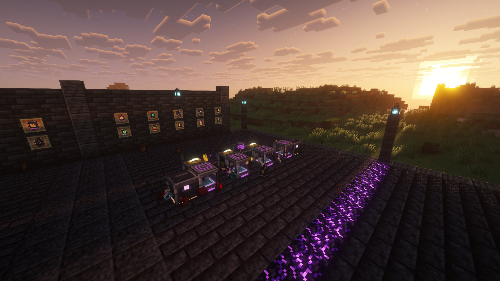
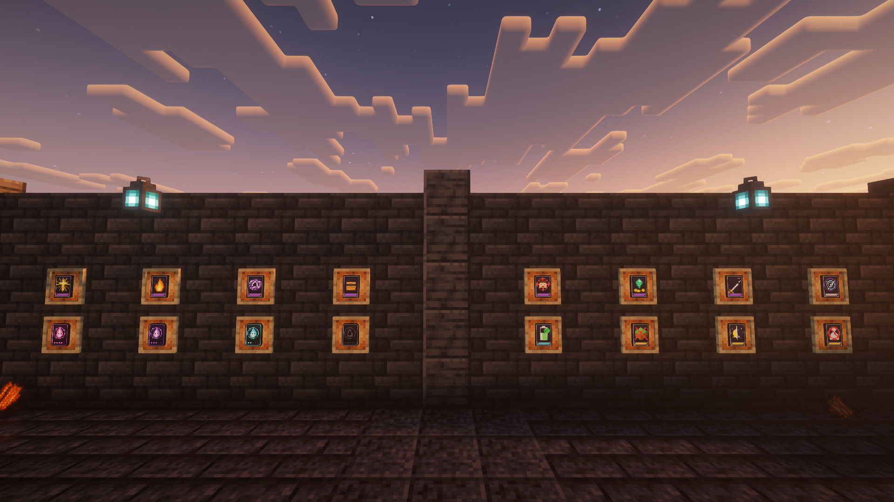
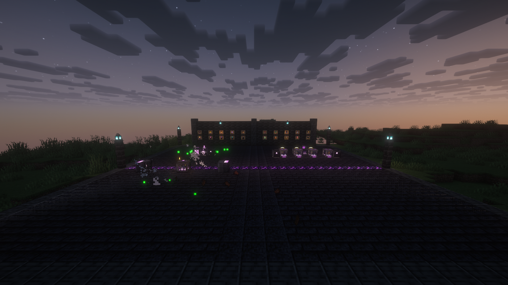
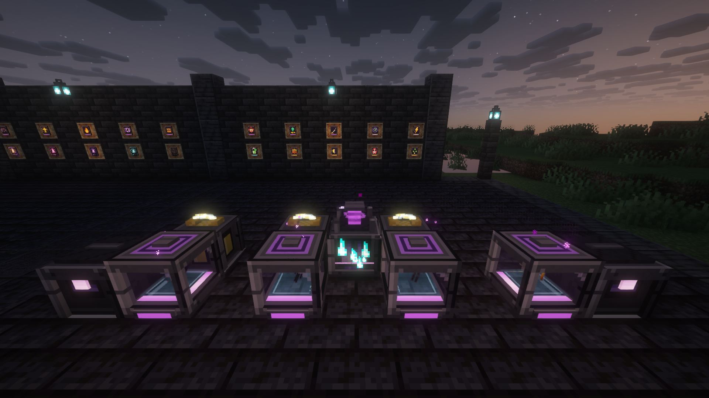
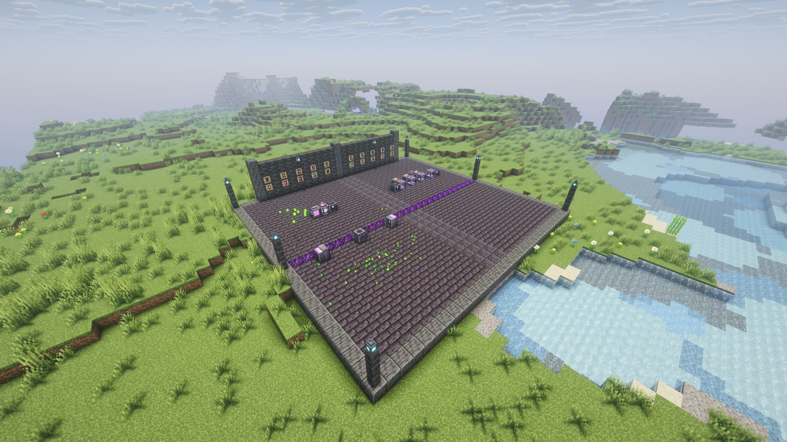
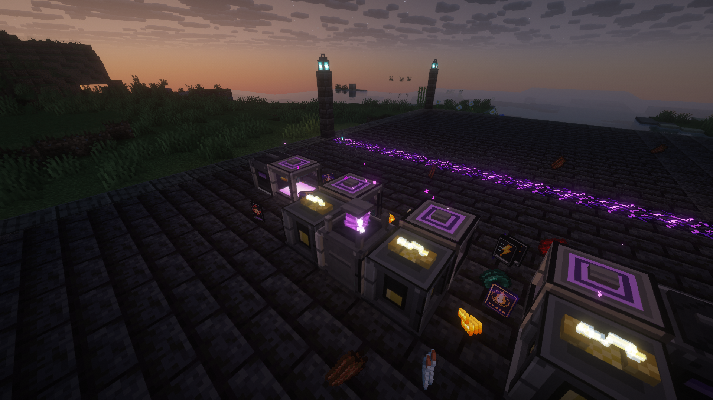
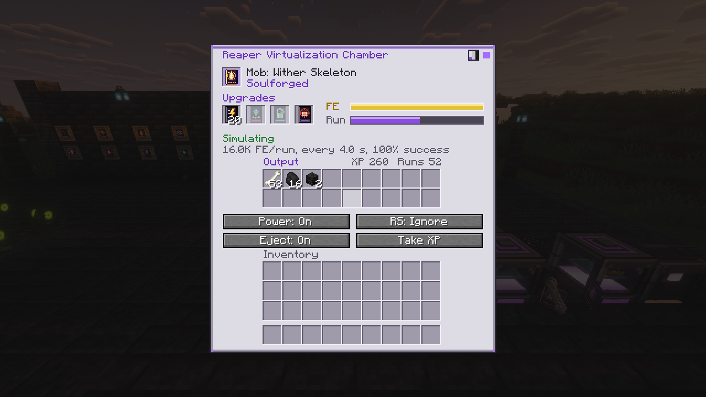
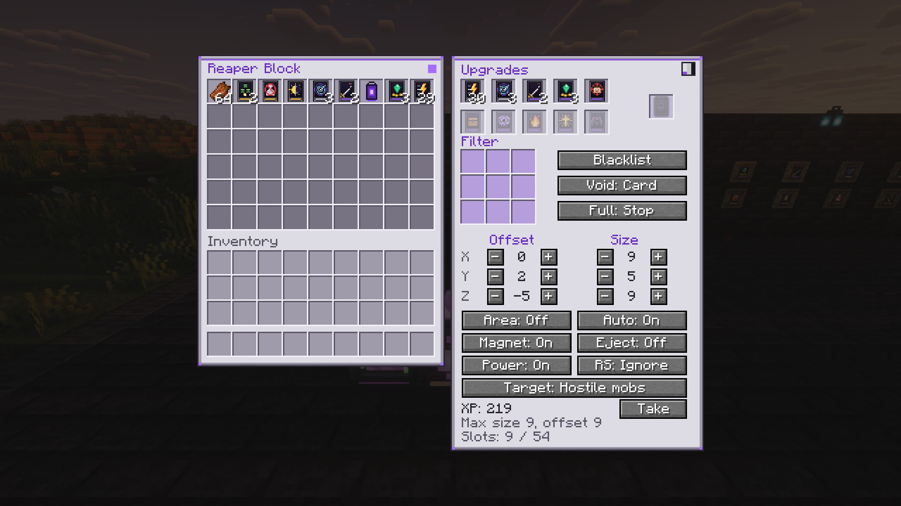

<p align="center"></p>

<p align="center">
  <b>Kill. Capture. Spawn. Virtualize.</b><br>
  A complete mob-farming tech line for <b>NeoForge 1.21.1</b>, from your first laser grinder to lag-free virtual farms that power themselves.
</p>

---

## Overview

Grim Soul Industries takes everything great about mob-farming mods and puts it in one clean, black-and-purple tech line. Grind mobs with laser-firing **Reaper Blocks**, capture any creature in a **Reaper's Lantern**, spawn it on demand with the **Reaper Spawner**, burn its drops for power in the **Reaper Generator**, and finally replace your whole farm with a **Reaper Virtualization Chamber** that rolls the mob's real drops with **no entity ever spawned**.

<p align="center"></p>

## Features

### Tier 1 — Reaping
| Block | What it does |
| --- | --- |
| **Reaper Block** | Fires purple lasers at every mob in its work area. Hostile / Friendly / Players / All target modes, magnet on/off, filter + void, up to 54 slots, auto-eject, Soul Card slot. Placed **off** and **hostile-only** so it never hits you by surprise. |
| **Reaper's Lantern** | Right-click a mob to capture it, right-click a block to release it. |
| **Reaper Fan** | Pushes mobs into your kill zone with an adjustable push area. |
| **Reaper XP Tank** | Stores XP as Liquid Experience (20 mB = 1 XP), pulls in orbs, works with pipes and AE2. |

### Tier 2 — Spawning & Power
| Block | What it does |
| --- | --- |
| **Reaper Spawner** | Spawns any captured mob, charging FE up to each spawn. Up to 20 mobs per spawn, ignore light or every spawn rule. |
| **Reaper Generator** | Burns mob drops for FE — rotten flesh to nether stars. Per-side item and energy config, pass-through for whole farm outputs. |
| **Reaper Energy Cell** | 10M FE storage with per-side In / Out / Off, keeps its charge when broken. |

### Tier 3 — Virtualization
| Block / Item | What it does |
| --- | --- |
| **Reaper Soul Card** | Bind it to a mob and level it up: Hollow → Whispering → Restless → Wraithbound → Soulforged. |
| **Reaper Virtualization Chamber** | Runs the mob's real death drops (including modded drops) with no entity in the world. Player Kill card for player-only loot like wither skeleton skulls. |
| **Reaper Output Crate** | 54 slots of storage with void overflow so your chambers never stall. |

### 15 upgrade cards
Speed · Range · Damage · Looting · Player Kill · Storage · Void · Fire Aspect · Smite · Bane of Arthropods · Count · No Player Needed · Ignore Light · Ignore Spawn Conditions · Efficiency — each with its own art and a per-machine limit.

<p align="center"></p>

### Polish
- Layered 3D machines with their own animations: floating soul crystals, spinning fan blades, soul rings, energy arcs and hologram scans.
- Three GUI styles — **Reaper** (light gray and purple), **Vanilla** and **Dark** — switchable from any machine screen.
- Works with any FE mod, Pipez, Mekanism cables, AE2, Refined Storage and hoppers.
- Fully configurable (`config/grimsoul-common.toml`), with data-driven generator fuels (`data/grimsoul/data_maps/item/generator_fuel.json`).

## Gallery
| | |
| --- | --- |
|  |  |
|  |  |
|  |  |

## Requirements
- Minecraft **1.21.1**
- NeoForge **21.1.0** or newer

## Building from source
```
./gradlew build
```
The jar appears in `build/libs/`. On Windows you can double-click `BUILD.bat` (see `BUILD_GUIDE.md`).

## Modpacks
Yes! You may include Grim Soul Industries in any modpack on CurseForge or Modrinth. Made for, and first shipped in, the **Nine Craft** modpack.

## License
Copyright © 2026 xTri6. All Rights Reserved — see [LICENSE](LICENSE) for what you can and can't do.
